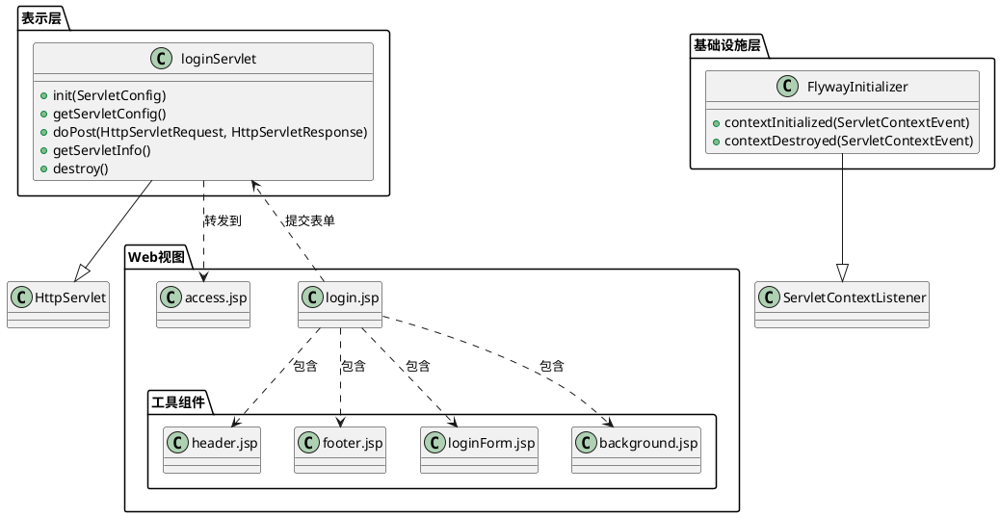

```plantuml
@startuml
package "表示层" {
  class loginServlet {
    +init(ServletConfig)
    +getServletConfig()
    +doPost(HttpServletRequest, HttpServletResponse)
    +getServletInfo()
    +destroy()
  }
}

package "基础设施层" {
  class FlywayInitializer {
    +contextInitialized(ServletContextEvent)
    +contextDestroyed(ServletContextEvent)
  }
}

package "Web视图" {
  class "login.jsp" as LoginJSP
  class "access.jsp" as AccessJSP

  package "工具组件" {
    class "header.jsp" as HeaderJSP
    class "footer.jsp" as FooterJSP
    class "loginForm.jsp" as LoginFormJSP
    class "background.jsp" as BackgroundJSP
  }
}

class HttpServlet
class ServletContextListener

' 继承关系
loginServlet --|> HttpServlet
FlywayInitializer --|> ServletContextListener

' 关联关系
loginServlet ..> AccessJSP : 转发到
LoginJSP ..> loginServlet : 提交表单
LoginJSP ..> HeaderJSP : 包含
LoginJSP ..> FooterJSP : 包含
LoginJSP ..> LoginFormJSP : 包含
LoginJSP ..> BackgroundJSP : 包含
@enduml
```